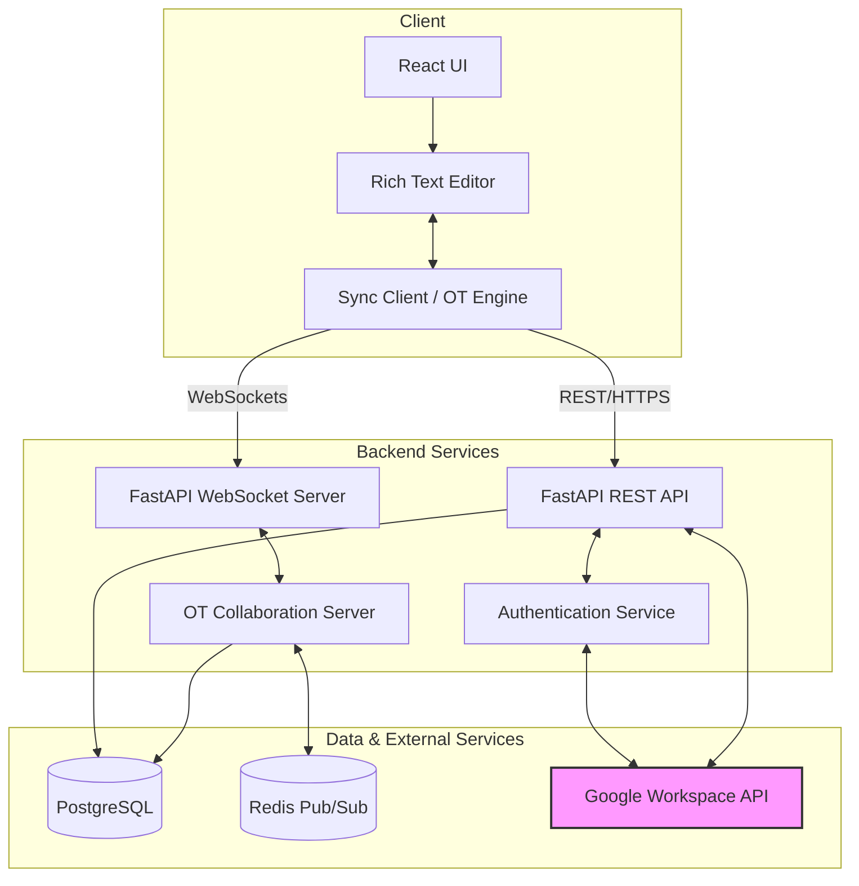

# Technical Design Document: SyncDocs

## 1. Document Properties
*   **Status:** DRAFT
*   **Tech Lead:** Antigravity (Google Senior Software Engineer)
*   **Date:** 2026-07-23
*   **Target Release:** v1.0.0 (MVP)

## 2. Executive Summary

### Problem Statement
Modern remote teams require seamless, real-time collaboration tools to maintain productivity. Existing solutions often suffer from synchronization conflicts or lack integration with enterprise identity and file management systems, specifically Google Workspace.

### Proposed Solution
"SyncDocs" is a real-time collaborative document editing application. It leverages a modern tech stack (React, FastAPI, WebSockets) to provide a low-latency editing experience. By implementing Operational Transformation (OT) algorithms, it ensures 100% data consistency during high-frequency concurrent edits. The system deeply integrates with Google Workspace APIs for unified authentication and secure file management.

### Goals
*   Provide real-time document synchronization with sub-100ms latency.
*   Resolve concurrent edit conflicts automatically using Operational Transformation.
*   Authenticate users and manage files exclusively via Google Workspace integration.
*   Maintain high software quality through a strict CI/CD pipeline enforcing automated testing.

### Non-Goals
*   Building a custom rich-text rendering engine from scratch (will leverage existing open-source editors like Quill or Prosemirror).
*   Offline editing support for the initial v1.0.0 release.
*   Complex access control lists (ACL) beyond standard Google Drive file permissions.

## 3. System Architecture (Technical Design)

SyncDocs utilizes a client-server architecture. The frontend is a React application that communicates with a FastAPI backend via both REST (for standard CRUD operations and authentication) and WebSockets (for real-time document synchronization). Data is persisted in a relational database (PostgreSQL), and authentication/file management leverages Google Workspace APIs.

### Architecture Diagram



## 4. Core Logic / Algorithms: Operational Transformation (OT)

Handling concurrent edits without data corruption requires Operational Transformation (OT). When multiple users edit the same document simultaneously, their operations (insert, delete, retain) can arrive at the server out of order relative to the current document state.

### Conceptual Breakdown

1.  **Operation Representation:** An edit is represented as a sequence of components. For example: `[Retain(5), Insert("hello"), Delete(2)]`.
2.  **Client State Tracking:** Each client maintains its current version (revision number) and any outstanding (unacknowledged) operations sent to the server.
3.  **Transformation Function `T(op1, op2)`:** The core of OT. If User A and User B concurrently generate `opA` and `opB` from the same document state, the transformation function calculates `opA'` and `opB'` such that applying `opA` then `opB'` yields the exact same document state as applying `opB` then `opA'`.
4.  **Server-Side Resolution:**
    *   The server maintains the central source of truth (the document content and a linear history of all applied operations).
    *   When a client submits an operation against an older revision `v`, the server transforms this operation against all operations applied since `v`.
    *   The transformed operation is applied to the server's document state, appended to the history, and broadcast to all other connected clients.
5.  **Client-Side Resolution:**
    *   Clients receive acknowledged operations from the server.
    *   If a client has pending operations, it must transform incoming server operations against its pending operations before applying them to the local UI.

## 5. Data Model & API Spec

### Brief Schema Design (PostgreSQL)

*   **Users:** `id` (UUID), `google_id` (String, unique), `email` (String), `name` (String), `created_at` (Timestamp).
*   **Documents:** `id` (UUID), `google_drive_file_id` (String, unique), `title` (String), `content` (Text/JSON), `current_revision` (Integer), `owner_id` (UUID, FK).
*   **Operations:** `id` (UUID), `document_id` (UUID, FK), `revision` (Integer), `user_id` (UUID, FK), `operation_data` (JSON), `created_at` (Timestamp).

### Key API Endpoints

#### REST API (FastAPI)
*   `POST /auth/google`: Exchange Google OAuth token for application session token.
*   `GET /api/documents`: List user's documents (synced with Google Drive).
*   `POST /api/documents`: Create a new document.
*   `GET /api/documents/{doc_id}`: Fetch document metadata and initial content state (including `current_revision`).

#### WebSocket API (FastAPI)
*   `ws://backend/ws/documents/{doc_id}`
    *   **Messages from Client:**
        *   `{"type": "join", "user_id": "...", "revision": 10}`: Subscribe to a document.
        *   `{"type": "operation", "revision": 10, "op": [...]}`: Submit a local edit.
    *   **Messages from Server:**
        *   `{"type": "init", "clients": [...]}`: Initial state after joining.
        *   `{"type": "ack", "revision": 11}`: Acknowledge client's operation.
        *   `{"type": "operation", "user_id": "...", "revision": 11, "op": [...]}`: Broadcast of another user's operation.

## 6. CI/CD & Testing Strategy

The project employs a robust Continuous Integration and Continuous Deployment pipeline using GitHub Actions to enforce software quality.

### Testing Frameworks
*   **Backend:** `PyTest` for unit testing FastAPI endpoints, OT transformation logic, and database interactions.
*   **Frontend:** `Jest` and `React Testing Library` for unit and integration testing of React components and client-side OT synchronization.

### GitHub Actions Pipeline
1.  **Trigger:** On pull request to `main` or push to `main`.
2.  **Linting & Formatting:** Run `flake8`/`black` for Python and `eslint`/`prettier` for Javascript.
3.  **Backend Tests:**
    *   Setup Python environment.
    *   Spin up ephemeral PostgreSQL/Redis instances (Docker services).
    *   Execute `pytest --cov`.
4.  **Frontend Tests:**
    *   Setup Node environment.
    *   Execute `npm run test` (Jest).
5.  **Build:** Create production builds of the React app and Docker images for the FastAPI backend.
6.  **Quality Gate:** Ensure >80% test coverage and 0 linting errors before allowing merges.

## 7. Scaffolding & Action Plan

### Milestone 1: Environment Initialization

Run the following terminal commands to set up the repository structure and install core dependencies.

```bash
# 1. Initialize Git Repository
mkdir SyncDocs
cd SyncDocs
git init
echo "# SyncDocs" > README.md
echo -e "node_modules/\n.venv/\n__pycache__/\n.env" > .gitignore

# 2. Setup Backend (Python/FastAPI)
mkdir backend
cd backend
python -m venv .venv
# Activate venv (Windows: .venv\Scripts\activate, Unix: source .venv/bin/activate)
.venv\Scripts\activate
pip install fastapi uvicorn websockets sqlalchemy psycopg2-binary pytest pytest-asyncio pydantic-settings google-api-python-client google-auth-httplib2 google-auth-oauthlib
pip freeze > requirements.txt
mkdir app tests
touch app/__init__.py app/main.py tests/__init__.py
cd ..

# 3. Setup Frontend (React/Vite)
# (Assuming Node.js is installed)
npx -y create-vite@latest frontend --template react-ts
cd frontend
npm install
npm install socket.io-client axios
npm install -D jest @testing-library/react @testing-library/jest-dom ts-jest @types/jest
cd ..

# 4. Initial Commit
git add .
git commit -m "chore: initial project scaffolding for backend and frontend"
```
